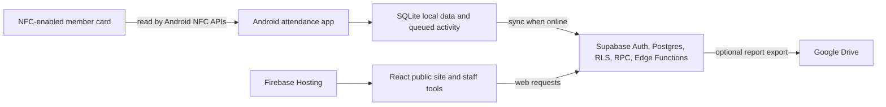
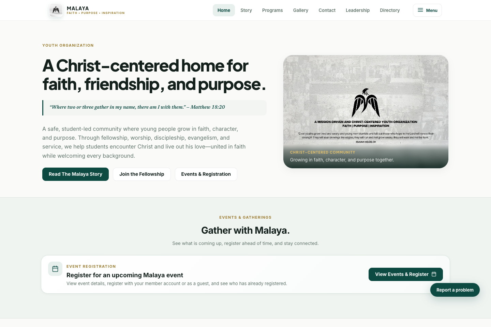
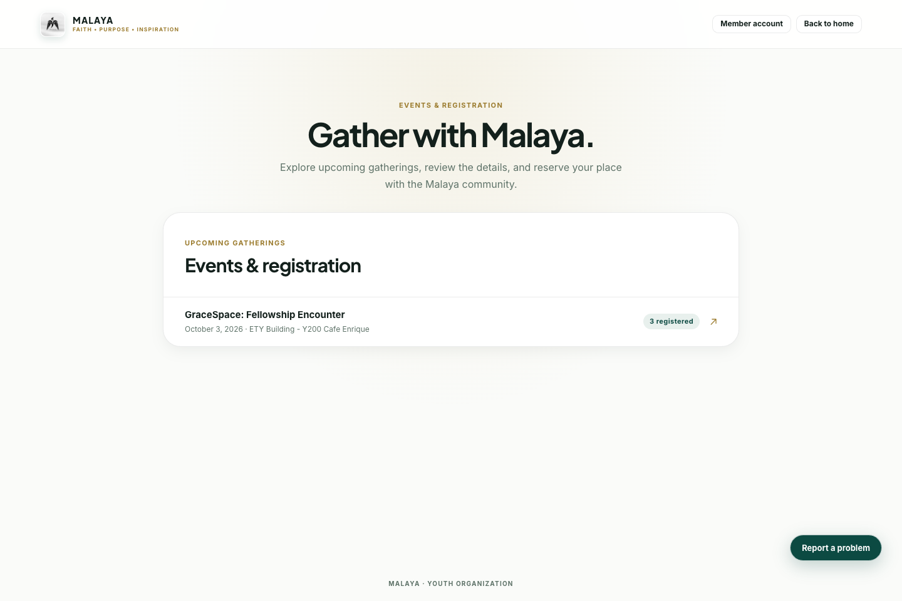
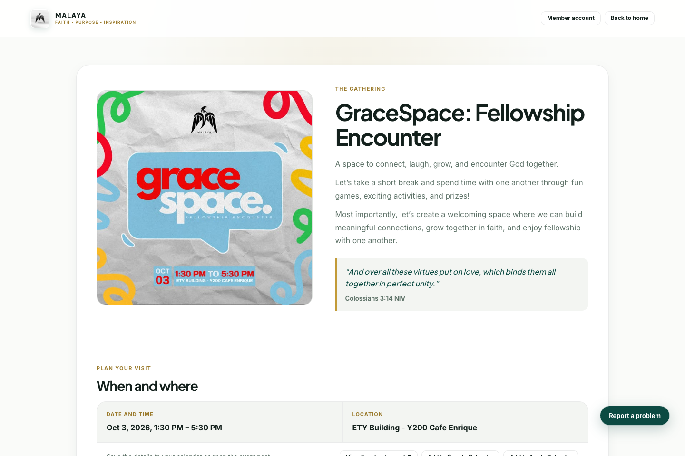
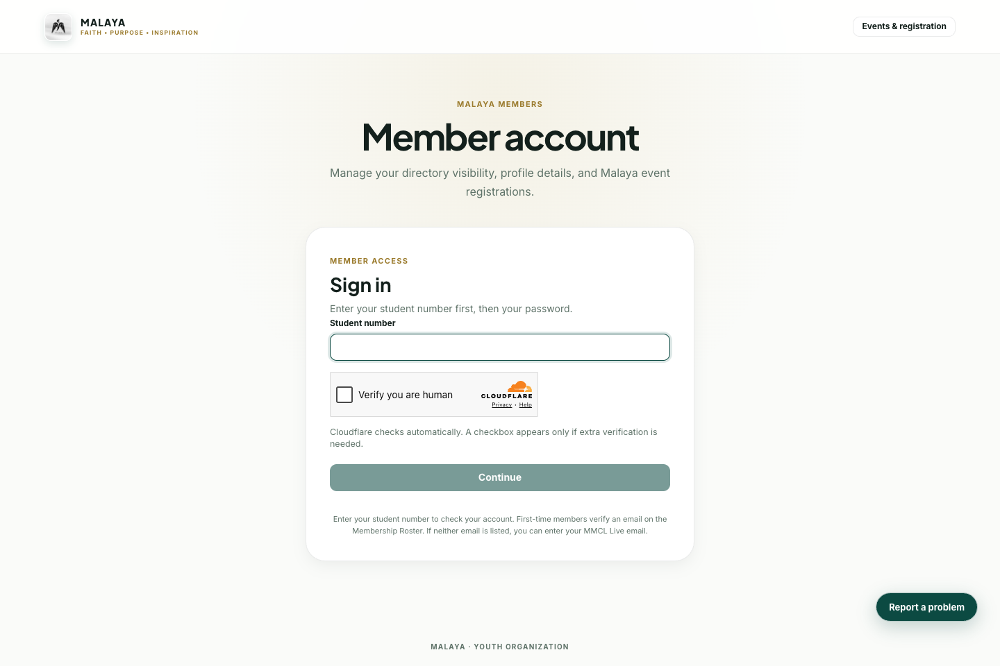
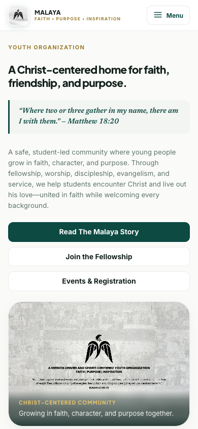
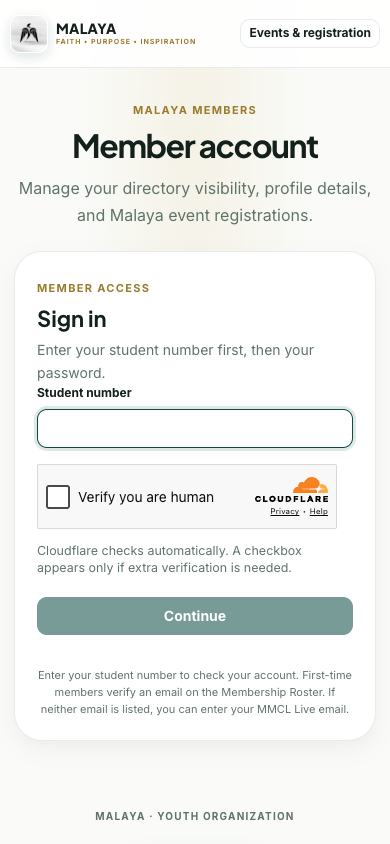
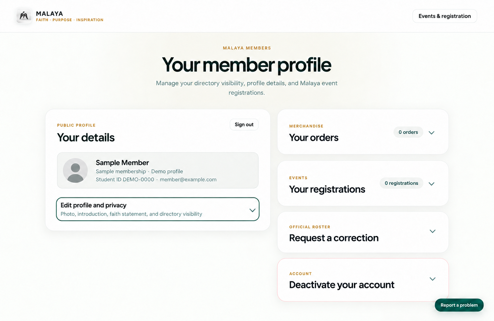
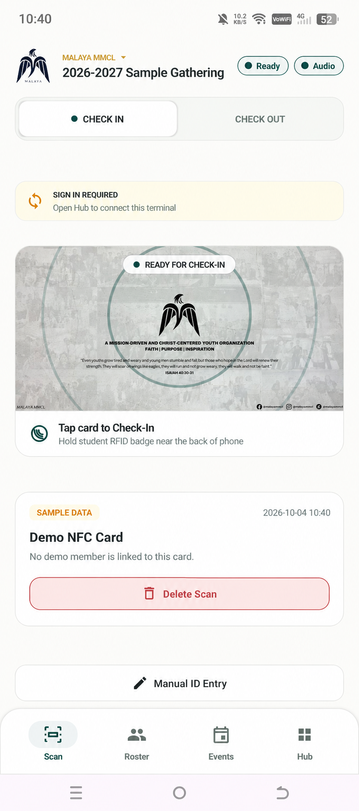
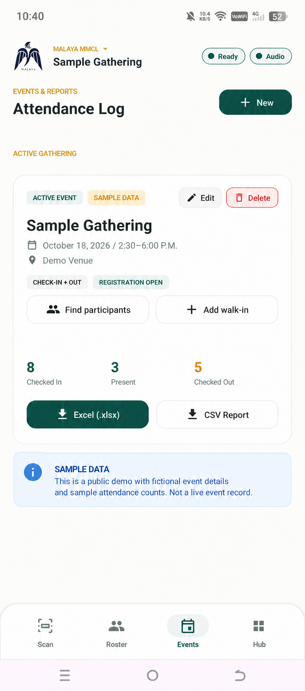

# MALAYA MMCL Attendance

MALAYA MMCL Attendance supports event check-in and community operations for MALAYA, a student-led Christian youth organization at Mapúa Malayan Colleges Laguna. The project brings together an Android NFC attendance app, staff web tools, and public pages for gatherings and membership.

**Live community site:** [malaya-official.web.app](https://malaya-official.web.app) · [Events and registration](https://malaya-official.web.app/events) · [Member access](https://malaya-official.web.app/account)

## What the platform does

- **NFC attendance:** Authorized staff use an Android phone to check members in and out with NFC-enabled student cards.
- **Offline operation:** The Android app keeps attendance work locally while offline and syncs queued activity when a connection returns.
- **Staff tools:** Authorized staff manage gatherings, attendance, member records, scanner access, and published community content.
- **Member experience:** Members can manage their profile and directory visibility and see their event registrations.
- **Public information:** The website presents MALAYA's story, programs, gatherings, gallery, and event registration.

The Android app uses the phone's NFC reader APIs. The cloud service validates online scan requests and provides the authoritative attendance result.

## Technology

| Area | Technology |
| --- | --- |
| Android app | Kotlin, Android Views, Material Components, AndroidX, Android NFC APIs, SQLite, WorkManager |
| Web app | React 19, TypeScript, Vite, Supabase JavaScript client |
| Backend | Supabase Auth, PostgreSQL, row-level security, REST/RPC, Edge Functions, and Storage |
| Edge Functions | Deno and TypeScript |
| Hosting | Firebase Hosting for the web app; optional Firebase App Distribution for Android builds |
| Reporting | Optional Google Drive export; Supabase is the attendance source of truth |

## How the parts fit together

## Screenshots

The public-site captures were taken on October 4, 2026. The member-profile and Android app images are clearly labeled synthetic examples based on supplied screenshots; real identity, card, event, and attendance details were replaced.

### Public site and gatherings

| Home | Events | Gathering details |
| --- | --- | --- |
|  |  |  |

### Member access and mobile web

| Member sign-in | Home on a phone-sized screen | Member sign-in on a phone-sized screen |
| --- | --- | --- |
|  |  |  |

The phone-sized web images show the responsive website.

### Member profile (synthetic example)

The third supplied reference image is represented here with a generic avatar and placeholder profile data.

### Android app (synthetic examples)

| NFC check-in | Attendance log |
| --- | --- |
|  |  |

These edited app examples use fictional event, card, and attendance values. They do not show a real scan record, participant list, or live event.

## Privacy and repository scope

This is a public project overview with screenshots. It does not distribute the application source or operational documentation. The implementation is maintained separately.

No environment files, credentials, personal member details, rosters, or live attendance records are included here. The sample app and profile screens use placeholder data only; live account and attendance data belong in the authenticated application. Public screenshots should use public pages or synthetic data only.
